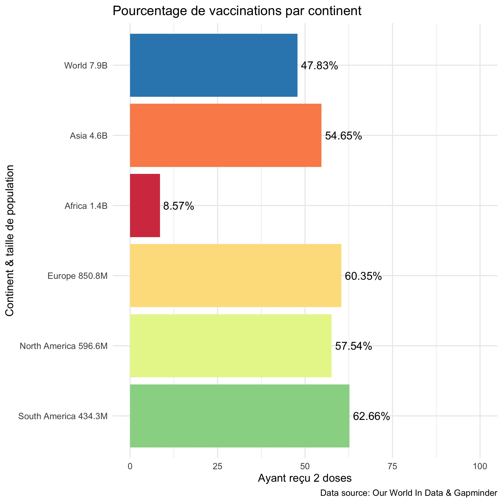

```{r setup, include=FALSE}
knitr::opts_chunk$set(echo = FALSE)
```

```{r,include=FALSE}
library(tidyverse)
library(scales)
library(lubridate)
library(RColorBrewer)

continent_vax <- read_csv("data/processed/continent_vax.csv")
vax_raw <- read_csv("data/raw/covid19vacc.csv")

days_passed <- difftime(Sys.time(),as.Date("2021-12-22"), units = "days")
#Combien de temps à passé depuis ma publication

days_passed <- format(round(days_passed, 2), nsmall = 2)
#Arrondissement du chiffre

n_vax_2021_12_22 <- 4476161541
#Le nombre de personnes ayant reçu au moins une doses du vaccin
#au jour de ma publication.


total_vax_world <- vax_raw %>% 
              mutate(location=factor(location)) %>% 
            filter(location == "World") %>%
         slice(which.max(as.Date(date, '%Y/%m/%d')))
#le résultat le plus récent pour la population total ayant reçu une dose

total_vax_word <- total_vax_world$people_vaccinated
#associe la valeur à un objet

new_vax <- total_vax_word-n_vax_2021_12_22
#soustraction du total d'aujourd'hui moins l'effectif lors de ma publication

new_vax <- label_number_si(accuracy=0.1)(new_vax)
#conversion en abbréviation
```


[@andrew_lichtenstein_interview_2020]

Il est difficile de croire que nous somme déjà rendu à la troisième dose du vaccins contre la Covid-19 alors que la moitié de la planète n'a pas encore reçu sa deuxième dose. En effet si, on se fit au graphique ci dessous c'est moins de la moitié.[^1]



[^1]: Mon analyse à été fait en décembre 2021, ce graphique est le seul qui n'est pas mis à jour quotidiennement avec les nouvelles données de vaccinations.

J'ai publié mon projet final le 22 décembre 2021.Depuis, `r days_passed` (jours) ont passés et `r new_vax` de personnes de plus ont reçu leur première dose du vaccin contre la Covid-19. Le graphique ci-dessous contient les taux par continent avec les données les plus récente.


```{r}
graph_cont <- ggplot(continent_vax,
                 aes(x= reorder(paste(location, pop_text),population),
                      y= people_fully_vaccinated_per_hundred, fill=location))+
        geom_bar(stat="identity", show.legend=FALSE)+
        scale_fill_brewer(palette="Spectral")+
        geom_text(aes(label = paste0(people_fully_vaccinated_per_hundred,"%")),
                    hjust = -0.1)+
        labs(x = " ", y = "Ayant reçu 2 doses",
            title = "Pourcentage de vaccinations par continent",
            caption = "Data source: Our World In Data")+
        expand_limits(y = 100)+
        theme_minimal()+
        coord_flip()
graph_cont
```

Dans les pages qui suivent, vous allez pouvoir avoir une description des données utilisées ainsi que des variables les constituants sur la page [1-intro](1-intro.html). Une analyse plus détaillée ainsi que des visualisations seront disponible sur la page [2-analyse](2-analyse.html). Pour ceux qui ont suivit un cours de programmation R, la page [3-manipulation](3-manipulation.html) sera consacré aux bribe de code R qui m'ont servis tout au long de mon projet.


Bonne lecture !

## Remerciements {.appendix}

J'aimerais remercier mon enseignant pour le cours FAS1002 qui nous beaucoup appris cette session.
